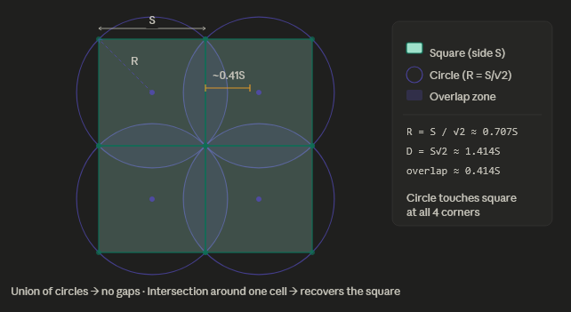

# Summary 

Leaflet map with restaurants and their health inspection info

## Main Flow 
1. Get all restaurants in Missoula with Google Places. Put in a json file. Store in Google Storage.
1. Get all health inspections for 

## Future Work
* Give the `get_missoula_restaurants.py` script arguments to tweak the tuning easily. 
* Get all health inspection data for all resaurants
* A script/arg for after all the Missoula restaurant history has been extracted to only get the new health department data; stop redundancy and hitting their servers all over again.

## Extract

### Google Places
`get_missoula_restaurants.py` gets all Missoula Restaurants from Google Places API. 

There are restrictions in the API:
* You have to specify the coordinates and the radius of the area you'd like to select. 
* There is a max amount of places that can be extracted per API call -- I believe it's 32. 

With these restrictions, you need to fine-tune the parameters so you can minimize the API calls and computing, but also get all the restaurants. 

### Health Dept

